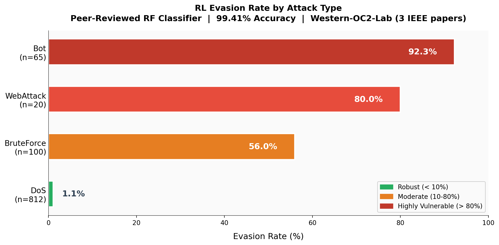
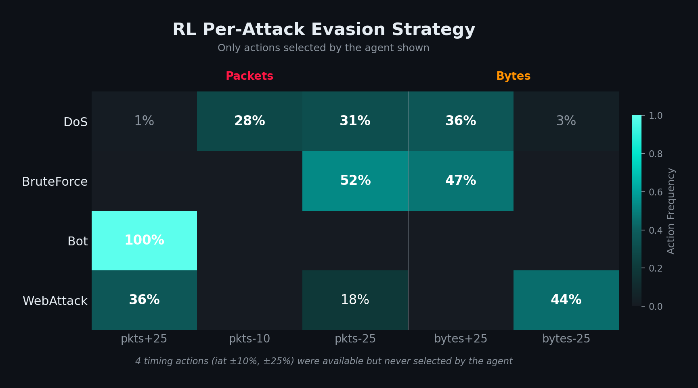

# Adversarial RL IDS Evasion

**An RL agent that red-teams ML-based intrusion detection systems by discovering evasion strategies automatically.**

I trained a PPO agent to attack a [peer-reviewed Random Forest classifier](https://github.com/Western-OC2-Lab/Intrusion-Detection-System-Using-Machine-Learning) with 99.41% accuracy. The agent modifies only what a real attacker controls — their own outbound traffic — and every modification must keep the malicious payload functional.

The classifier's 99.41% accuracy hides attack-specific blind spots:



## Key Results

| Metric | Value |
|--------|-------|
| Target classifier accuracy | **99.41%** (peer-reviewed, reproduced) |
| Flow pool | 2,313 malicious flows (>40 bytes payload) |
| Random baseline | 1.5% |
| 3-step exhaustive ceiling | 16.0% |
| **PPO (5-step)** | **13.4% ± 1.1%** |

### Per-Attack Evasion

| Attack Type | Evasion Rate | Flows | Interpretation |
|-------------|-------------|-------|----------------|
| Bot C&C | **92.3%** | 65 | Small C&C flows reshaped to look like browsing |
| WebAttack | **80.0%** | 20 | Payloads split into many smaller packets |
| BruteForce | **56.0%** | 100 | Login attempts padded and coalesced |
| DoS | **1.1%** | 812 | Large flows can't be reshaped enough |

DoS is nearly unbreakable. Bot and WebAttack are highly vulnerable. A single accuracy number doesn't tell you this.

## How It Works

The agent operates in a [Gymnasium](https://gymnasium.farama.org/) environment where each episode is one malicious network flow. It gets 5 steps to evade the classifier by choosing from 12 discrete actions:

- **Modify forward packets** (±10%, ±25%) — split, coalesce, or add dummy packets
- **Modify forward bytes** (±10%, ±25%) — pad or compress payload
- **Modify forward timing** (±10%, ±25%) — add or remove inter-packet delays

**Constraints enforced at every step:**
- Minimum 50% of original value for each feature (payload must still be deliverable)
- Bytes rounded to integers (physical constraint)
- MTU limit of 1500 bytes per packet
- All derived features (means, rates, distributions) recalculated from base modifications

The agent only controls 3 of 77 features. The other 74 (server responses, flags, connection patterns) are locked.

### Strategies the Agent Discovered

The agent learned **different strategies for different attack types** — not a single universal approach:

- **Bot C&C:** increase packets exclusively — flood small C&C flows with dummy packets until they look like browsing sessions
- **BruteForce:** reduce packets + increase bytes — coalesce login attempts into fewer, larger packets mimicking web traffic
- **WebAttack:** increase packets + reduce bytes — the opposite of BruteForce, splitting payloads into many small packets
- **DoS:** spreads across multiple actions but nothing works (1.1% evasion) — large flows can't be reshaped enough
- **Timing:** completely unused — the classifier doesn't rely on timing features



## Why RL?

The target classifier is a **Random Forest** — non-differentiable. Gradient-based attacks (FGSM, PGD, C&W) don't apply. Black-box gradient estimation exists but produces operationally unrealistic perturbations (can't constrain modifications to physically achievable traffic changes).

Genetic algorithms and Bayesian optimization optimize per-flow. **RL learns a transferable policy** — instant inference on new flows without re-searching.

## Reproduction

### Prerequisites

- Python 3.9+

### Setup

```bash
git clone https://github.com/MohammedSabith/rl-adversarial-ids-evasion.git
cd rl-adversarial-ids-evasion
pip install -r requirements.txt
```

### Train the Agent

```bash
python -m src.train
```

### Run Baselines

```bash
python -m src.baselines
```

### Test Your Own Classifier

The RL evasion loop is classifier-agnostic. Subclass `BaseEvasionEnv` and implement three methods:

```python
from src.base_environment import BaseEvasionEnv

class MyEvasionEnv(BaseEvasionEnv):
    def __init__(self):
        clf = load_your_classifier()
        flows = load_your_malicious_flows()  # shape: (n_flows, n_features)
        super().__init__(clf, flows, n_features=..., n_actions=...,
                         benign_class=0, max_steps=5)

    def _apply_action(self, flow, action):
        """Modify flow features. Return the modified flow."""

    def _recalculate_derived(self, flow):
        """Recompute any features derived from the modified ones."""

    def _is_valid(self, flow):
        """Return False if the modification violates physical constraints."""
```

The classifier needs a sklearn-compatible `predict_proba()` interface. The base class handles the RL loop: episode management, reward computation (`delta P(malicious)` + terminal bonuses), z-score normalization, and observation/action spaces. `train.py` and `baselines.py` are wired to the included Western-OC2-Lab environment. To train against your own, swap the env class in those files or use your subclass directly with any [Stable-Baselines3](https://github.com/DLR-RM/stable-baselines3) algorithm.

## Project Structure

```
├── src/
│   ├── base_environment.py         # Abstract base env (pluggable classifiers)
│   ├── western_oc2_environment.py  # Western-OC2-Lab RF evasion env
│   ├── train.py                    # PPO training pipeline
│   └── baselines.py                # Random + exhaustive baselines
├── models/western_oc2/
│   ├── rf_classifier.joblib        # Reproduced Western-OC2-Lab RF model
│   ├── ppo_evasion.zip             # Trained PPO agent
│   ├── malicious_flows.npy         # Malicious flow pool (CICIDS2017)
│   ├── feature_names.npy           # 77 CICFlowMeter feature names
│   ├── label_encoder.joblib        # Attack type label encoder
│   └── training_metrics.npy        # PPO training metrics (eval checkpoints)
├── results/figures/                 # Visualizations (5 charts)
└── requirements.txt
```

## Limitations

1. Distribution statistics are proportionally scaled, not recomputed from individual packets
2. Forward-only modification ignores request-response coupling
3. Evasion tested against `predict_proba`, not real network deployment
4. Results are specific to CICIDS2017 and this classifier architecture
5. Small sample sizes for Bot (n=65) and WebAttack (n=20)

## Credits

- **Target classifier:** [Western-OC2-Lab/Intrusion-Detection-System-Using-Machine-Learning](https://github.com/Western-OC2-Lab/Intrusion-Detection-System-Using-Machine-Learning) (Western University, Canada — 3 IEEE papers)
- **Dataset:** [CICIDS2017](https://www.unb.ca/cic/datasets/ids-2017.html) (Canadian Institute for Cybersecurity)
- **RL framework:** [Stable-Baselines3](https://github.com/DLR-RM/stable-baselines3) (PPO)

## License

MIT
